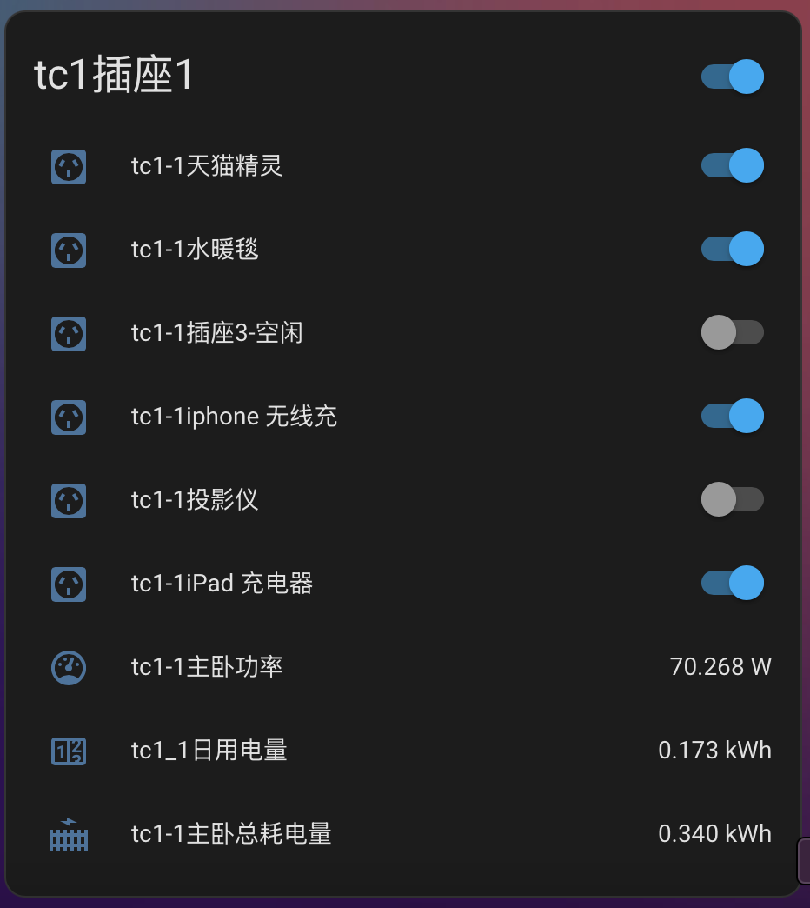

# 感谢原作者 [zogodo](https://github.com/zogodo/zTC1) 无私分享的代码
# 斐讯TC1 A1智能排插第三方固件
排插TC1因为服务器关闭,无法使用. 故而为其开发一个不需要服务器也能满足基本智能控制使用的固件.

# 固件web界面

# HASS接入效果

固件启动后, 会开启一个热点 TC1-AP-XXXXXX，连接热点后, 直接用浏览器访问: http://192.168.0.1 即可看到如上web界面.

XXXXXX 是 MAC 地址后六位.

# 注意

TC1 排插硬件分 A1 A2 两个版本, 本固件仅支持 **A1 版本**. A1 A2 两个版本仅主控不同, 除此之外其他无任何区别.

# 区分硬件版本

硬件版本在外包装底部,如图所示:

如果没有包装, 只能拆开分辨, 如图, 左侧为不支持的 A2 版本 右侧为支持的 A1 版本.

# 特性

本固件使用斐讯TC1排插硬件为基础,实现以下功能:

- [x] 按键控制总开关
- [x] 独立控制每个插口通断
- [x] Web实时显示功率和功耗
- [x] 添加定时任务控制插口通断
- [x] ota在线升级
- [x] 通过mqtt连入HomeAssistant

基于原作者 zogodo，我又新增了如下功能:

- [x] HomeAssistant中增加总耗电量传感器，今日耗电量传感器，昨日耗电量传感器，数据来自于插座历史统计
- [x] 可以设置mqtt数据上报频率，默认2秒
- [x] 可以设置电源 led 是否打开，默认打开（系统自检以及错误指示灯仍会工作）

# 编译固件

- windows环境，先安装python2.7
- 安装[mico-cube 1.0.0](https://files.pythonhosted.org/packages/a8/4e/687a3ef2edabfd9fdd797747d6eeb2ddbe70e65c49fa4062268281a0ded4/mico-cube-1.0.0.tar.gz#sha256=4a930d394344f72c862c203d5d8a832357c3b3dc940c825ca3e528453dd2f17f) python2 -m pip install ./mico-cube-1.0.0.tar.gz
- 安装[Micoder](http://firmware.mxchip.com/MiCoder_v1.3_Win32:64.zip)下载完解压出来（不要有中文路径）
- 安装完成后添加micoder路径 mico config --global MICODER (micoder所在路径)/MiCoder
- 最后切换到此项目根目录执行build.sh即可编译固件

